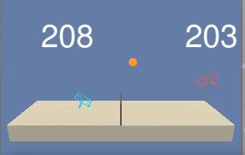

# Unity Tennis Collaboration

The project consists of an implementation of MADDPG (Multi Agent Deep Deterministic Policy Gradient) as published in the original paper [MADDPG](https://proceedings.neurips.cc/paper/2017/file/68a9750337a418a86fe06c1991a1d64c-Paper.pdf) in order to train a couple of tennis player. The aim of the MADDPG agente is to keep the tennis ball in play as long as possible.
A wide description of the Reacher Unity environments is on [Unity ML-Agents Toolkit](https://github.com/Unity-Technologies/ml-agents).
Let's underline that for this project we used a slightly different version of the original Unity Environment, provided by the [Reinforcement Learning Nanodegree progam of **Udacity**]( https://www.udacity.com/course/deep-reinforcement-learning-nanodegree--nd893).



## Descritpion of the environment

In this environment, two agents control rackets to bounce a ball over a net. If an agent hits the ball over the net, it receives a reward of +0.1. If an agent lets a ball hit the ground or hits the ball out of bounds, it receives a reward of -0.01.

The state space of each agent has dimensions 24 and contains the position and the velocity of the ball and the racket. For each agent two continuous actions are available, corresponding to movement toward (or away from) the net, and jumping.

The task is episodic, and in order to solve the environment, the agents must get an average score of +0.5 (over 100 consecutive episodes, after taking the maximum over both agents). Specifically after each episode, we add up the rewards that each agent received (without discounting), to get a score for each agent. This yields 2 (potentially different) scores. We then take the maximum of these 2 scores. The environment is considered solved, when the average (over 100 episodes) of those scores is at least +0.5.

## Files provided

- **Tennis.ipynb** is the main python notebook which contains the main loop to train the MADDPG agents
- **maddpg.py** is the implementation of the MADDPG agents
- **model.py** contains both the actor neural network and the critic neural network
- **checkpoint_actor0.pth**, **checkpoint_critic0.pth**, **checkpoint_actor1.pth** and **checkpoint_critic1.pth** which contain the model weights of a successful actor and critic network (for both agents)
- To run the code properly a **python** folder is provided. The project environment is similar to, but not identical to the Tennis environment on the [Unity ML-Agents GitHub page](https://github.com/Unity-Technologies/ml-agents). This folder, provided by the [Reinforcement Learning Nanodegree progam of **Udacity**]( https://www.udacity.com/course/deep-reinforcement-learning-nanodegree--nd893), there are all the files needed for the installation of the Unity environments. 
- The **Report_tennis.pdf** describes the details of the implementation and more ideas about the MADDPG algorithm.

## Requirements and installation

To run the notebook **Tennis.ipynb** it firstly needs to set up the environment as follows:

- Create (and activate) a new kernel with Python 3.6
    - **Linux** or **Mac**
   ```
   conda create --name drlnd python=3.6
   source activate drlnd
    ```  
    - **Windows**
   ```
    conda create --name drlnd python=3.6
    activate drlnd
   ```

- If you didn't before, you need a minimal install of OpenAI gym
```
pip install gym
pip install gym[classic_control]
pip install gym[box2d]
```

- Clone the repository, and navigate to the python/ folder. Then, install several dependencies.
```
git clone https://github.com/udacity/deep-reinforcement-learning.git
cd deep-reinforcement-learning/python
pip install .
```

- Create an IPython kernel for the dqn environment.
```
python -m ipykernel install --user --name drlnd --display-name "drlnd"
```

- Download the Unity Environment which matches your operating system
    - [Linux](https://s3-us-west-1.amazonaws.com/udacity-drlnd/P2/Reacher/Reacher_Linux.zip)
    - [Mac](https://s3-us-west-1.amazonaws.com/udacity-drlnd/P2/Reacher/Reacher.app.zip)
    - [Windows (32bit)](https://s3-us-west-1.amazonaws.com/udacity-drlnd/P2/Reacher/Reacher_Windows_x86.zip)
    - [Windows (64bit)](https://s3-us-west-1.amazonaws.com/udacity-drlnd/P2/Reacher/Reacher_Windows_x86_64.zip)

and unzip in a folder of your choice

- Then you can finally open the **Tennis.ipynb**. Before running code in this notebook
    - change the kernel to match the drlnd environment by using the drop-down Kernel menu
    
    
 
    - In the following line
    ```
    env = UnityEnvironment(file_name="...")
    ```
    change the folder path where you installed the Reacher unity environment.
